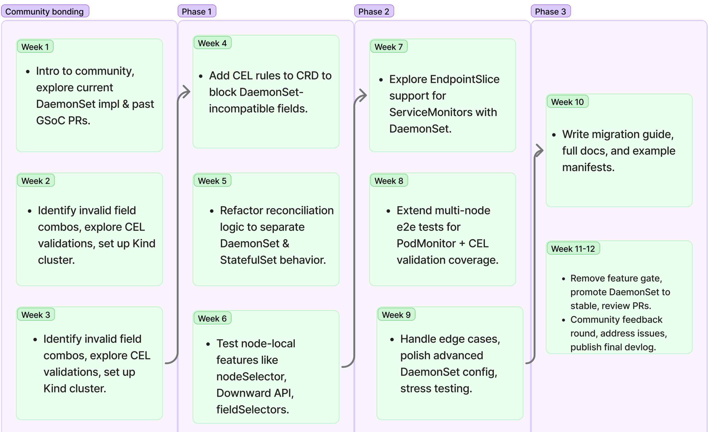

### Table of Contents

[TOC]

<div style="page-break-after: always;"></div>

## Introduction
### 1. About me

I am a sophomore pursuing a B.E. in Information Science and Engineering in Bangalore, India. I have a strong interest in Backend Development and DevOps, with a particular focus on cloud-native technologies.

My interest in Prometheus Operator stems from its crucial role in simplifying Kubernetes monitoring. Observability is a key challenge in cloud-native environments, and Prometheus Operator provides a structured and scalable approach to managing Prometheus deployments.

The DaemonSet mode for Prometheus Agent is an exciting step forward in making Prometheus Agent more efficient for node-level monitoring. I am eager to contribute to this project by identifying gaps in the current implementation, improving its functionality, and ensuring a seamless user experience.

### 2. Past experiences
Over the past few months, I’ve actively contributed to CNCF projects such as **Prometheus Operator, KubeArmor, KCL Lang, and Kro**. 
At the time of writing this proposal, I have three PRs in Prometheus Operator, with two merged and one currently open.

Beyond open-source, I’ve also worked as a **Backend engineering** Intern at WeCofy, where I developed and integrated Juristo’s AI-powered legal API, focusing on scalability, rate-limiting, and subscription-based access control.

#### 2.1 Notable Projects
- **Sentinel** *(Winner: Sandbox Hackathon 2025)*: A VS Code extension that enhances security while coding by enforcing YARA rules and suggesting fixes via a fine-tuned SecBERT transformer. [Github repo](https://)

- **CodeBrewery** *(Hobby project)*: A microservices-based online IDE that enables users to write and run code in multiple languages. Backend in Golang, frontend in React/TypeScript. [Github repo](https://github.com/slashexx/codebrewery)

- **Fractal** *(GoFr Hackathon 2024)*: A flexible data processing tool built with GoFr and Golang. Handles multi-source data ingestion, transformations, and validations.

- **PRism** *(FOSSHacks 2025)*: A self-hosted AI-powered code review tool that automates reviews for code, documentation, and security standards, ensuring compliance and efficiency.

  

### 3. Open-Source contributions
| Repository | Pull Request | Issue Solved | Description | Status |
|------------|-------------|--------------|-------------|--------|
| prometheus-operator/prometheus-operator | [#7328](https://github.com/prometheus-operator/prometheus-operator/pull/7328) | [#7320](https://github.com/prometheus-operator/prometheus-operator/issues/7320) | Integrated support for **RocketChat receiver** in `AlertManagerConfig CRD`. | **Open** |
| prometheus-operator/prometheus-operator | [#7238](https://github.com/prometheus-operator/prometheus-operator/pull/7238) | [#7206](https://github.com/prometheus-operator/prometheus-operator/issues/7206) | Refactored `OVHCloudSDConfig` as part of the `ScrapeConfig` API refactor. | **Merged** |
| prometheus-operator/prometheus-operator | [#7123](https://github.com/prometheus-operator/prometheus-operator/pull/7123) | [#7094](https://github.com/prometheus-operator/prometheus-operator/issues/7094) | Added a GitHub Action linter using `actionlint` to improve CI reliability. | **Merged** |
| kcl-lang/kcl | [#1697](https://github.com/kcl-lang/kcl/pull/1697) | [#1664](https://github.com/kcl-lang/kcl/issues/1664) | Added `filesha512` and `fileblake3` hashing to the crypto module. | **Merged** |
| kubearmor/KubeArmor | [#1930](https://github.com/kubearmor/KubeArmor/pull/1930) | [#1929](https://github.com/kubearmor/KubeArmor/issues/1929) | Added buffer queue processing for handling large Docker event streams. | **Merged** |
| kro-run/kro | [#354](https://github.com/kro-run/kro/pull/354) | [#353](https://github.com/kro-run/kro/issues/353) | Implemented **Go vanity import path** for Kro. | **Merged** |

### 4. Commitments during GSoC
I have no prior commitments during the GSoC period and I'll be able to work 35-45 hours per week solely on completing this project.


<div style="page-break-after: always;"></div>

## Project Proposal

### 5. Abstract  
**Monitoring** at scale in Kubernetes often requires lightweight, efficient solutions for metric collection. The **Prometheus** **Agent**, a trimmed-down version of Prometheus focused on remote writing metrics, is well-suited for this use case. While Prometheus Operator introduced **DaemonSet mode** for the Agent during GSoC 2024, the implementation is incomplete and remains behind a feature flag.

Currently, missing functionalities limit its usability in production, preventing seamless adoption. This project aims to **identify gaps, enhance configuration options, improve reliability**, and bring DaemonSet mode to full production readiness. By refining this deployment model, we can provide Kubernetes users with a scalable, efficient, and fully supported way to run Prometheus Agent across nodes.

### 6. Motivation
**Observability** is a crucial aspect of managing modern cloud-native workloads, and Prometheus Operator plays a key role in simplifying Prometheus deployments in Kubernetes. The **DaemonSet mode** for **Prometheus Agent** is an exciting step toward making metric collection more lightweight, scalable, and efficient, but its current limitations prevent it from being production-ready.

What excites me most about this project is the opportunity to work on **Kubernetes controllers**, **Prometheus internals,** and large-scale monitoring systems, all while contributing to an actively used **CNCF project**. Personally, I see this as a chance to deepen my expertise in **Kubernetes operators** and gain hands-on experience in real-world observability challenges.

Success for me would mean bringing **DaemonSet mode to production readiness**, ensuring it works **reliably** across different environments, and making it easier for users to adopt through better documentation and tutorials. Professionally, this project will strengthen my skills in **Golang**, **Kubernetes controllers**, and **Prometheus' monitoring stack**, helping me grow as a **backend** and **DevOps engineer**.

### 7. Project plan

#### 7.1 Overview

In the previous GSoC, the Prometheus Operator added experimental support to deploy a **PrometheusAgent** as a **DaemonSet**. This enables a lightweight, node-local scraping model that reduces resource consumption and avoids the need for persistent storage. However, the feature is currently gated behind a feature flag, as key components such as **CRD validation**, documentation, test coverage, and some functionalities are still missing.

The goal of this project is to bring **DaemonSet mode** for the PrometheusAgent to production readiness by identifying and addressing the remaining gaps, **improving CRD validation**, ensuring robust multi-node test coverage, and providing clear documentation and examples for users.

#### 7.2 Project goals

- **Stabilize DaemonSet Mode by Removing Feature Gate**:
  The existing DaemonSet mode for PrometheusAgent is currently hidden behind a feature flag due to its experimental status. One of the core outcomes of this project is to elevate this mode to **production quality** and make it the first-class alternative to the traditional StatefulSet deployment. Once all planned enhancements (validation, docs, tests) are completed, I will remove the feature gate.
- **Strengthen CRD Validation Using CEL Rules**:
  To ensure users can’t accidentally provide invalid or conflicting configurations, I will define **Custom Expression Language (CEL)** rules in the **PrometheusAgent CRD** schema. This will enforce strict validation directly at the Kubernetes API level, such as preventing `replicas` and `storage` fields when using **DaemonSet** mode. This not only improves UX but also reduces controller-side logic needed for handling misconfigurations.
- **Prevent Conflicting Spec Fields Based on Deployment Mode**:
  Certain fields that make sense for `StatefulSet` mode—like `replicas`, `storage`, and `volume` claims—are not applicable in **DaemonSet** deployments. I will ensure that users are explicitly blocked from supplying these fields when using the **DaemonSet** mode. This will be enforced through both CEL validation and runtime checks in the controller logic for backward compatibility on older Kubernetes versions.
- **Clarify Supported Fields and Write Migration Guidance**:
  To help users adopt DaemonSet mode safely, I will write comprehensive documentation outlining which fields are supported in each deployment mode, along with examples. The migration guide will walk users through converting their existing `PrometheusAgent` StatefulSet configuration to DaemonSet mode, including changes in storage handling, scaling behavior, and service discovery.
- **Explore Integration with EndpointSlice for ServiceMonitor**:
  Currently, node-local scraping is handled best through **PodMonitor**. However, if `EndpointSlice` can be filtered or used to expose node-specific endpoints efficiently, it might enable `ServiceMonitor` support in **DaemonSet mode** too. I will investigate this possibility and implement support if it’s feasible, while documenting trade-offs and limitations.
- **Expand Multi-Node Test Coverage Using Kind**:
  I will build a multi-node Kind cluster setup to simulate real-world environments and write integration tests that ensure each `PrometheusAgent` DaemonSet pod only scrapes targets on its own node. This will include testing `PodMonitor` behavior, field selectors like `spec.nodeName`, and ensuring no overlap or duplication in scraping targets.
-  **Provide Example Manifests and Usage Tutorials**:
  Clear examples go a long way in helping adoption. I will create example manifests that showcase `DaemonSet` mode usage, with various scenarios like `node-specific` monitoring, Downward API usage, and compatibility with existing PodMonitor configurations. 

#### 7.3 Implementation Plan & Technical details
- ##### 7.3.1 Adding CRD validations using CEL rules


I believe that it should not be important for users to read the source code of **Prometheus operator** to provide a more out of the box experience for them. Hence, it is imminent to to validate the code users write via CEL as this shifts error detection from runtime to CRD level - making feedback immediate.

To impliment this, the plan is to :
- Modify the PrometheusAgent CRD YAML schema to include `x-kubernetes-validations` blocks.
- Use **CEL expressions** to block fields that don’t make sense in **DaemonSet** mode.

For example :-

```yaml
x-kubernetes-validations:
  - rule: "self.mode == 'DaemonSet' ? self.replicas == null : true"
    message: "replicas is not allowed in DaemonSet mode"
  - rule: "self.mode == 'DaemonSet' ? self.storage == null : true"
    message: "storage cannot be set in DaemonSet mode"
```


The reason we choose CEL over Controller-only checks here is so that users get fast feedback from `kubectl` and not rely on the entire process to complete before realising they could've changed input formats.

Additionally, CEL works really well with `kustomize`, `kubecfg`, `helm` templates etc. This will also reduce logic bloat in controller code.


- ##### 7.3.2 Block Conflicting Field Combinations at Runtime (Fallback)

<p align="center">
  
</p>

While CEL-based validation is ideal for providing immediate **feedback** during `kubectl apply`, it does have limitations — primarily its dependency on Kubernetes v1.25+ and the fact that **not all users may have CEL enabled in their clusters**. To make the operator resilient across a wide range of environments, it's necessary to add **runtime checks** that ensure invalid field combinations don’t slip through.

This fallback validation logic will be integrated directly into the **PrometheusAgent** reconciliation process. Before a **PrometheusAgent** resource is converted into a `DaemonSet` or `StatefulSet`, the controller will inspect the CR spec and **reject invalid combinations** that don't make sense for the selected deployment mode.

For example, when `mode: DaemonSet` is specified, the following fields should be explicitly disallowed:
- `replicas` – since DaemonSets are node-bound and inherently non-replicated.
- `storage`, `volumeClaimTemplates` – as DaemonSets do not support persistent volumes in the same way StatefulSets do.

This check can be performed early in the reconciliation pipeline, ensuring no faulty DaemonSet manifests are generated or applied. If invalid combinations are found, the reconciliation loop can surface a clear error message in the PrometheusAgent’s status, improving UX.

Example logic:
```go
if spec.Mode == "DaemonSet" {
    if spec.Replicas != nil {
        return fmt.Errorf("replicas is not allowed when using DaemonSet mode")
    }
    if spec.Storage != nil {
        return fmt.Errorf("storage configuration is not supported in DaemonSet mode")
    }
}
```
This runtime check acts as a fallback safety net, ensuring validation regardless of the Kubernetes version, and reducing the risk of misconfigurations silently breaking monitoring workflows. This also **complements CEL** by ensuring the controller never proceeds with generating manifests based on invalid input.

- ##### 7.3.4 Investigating EndpointSlice support for ServiceMonitors

As clusters scale, traditional Kubernetes `Endpoints` resources become inefficient due to their large size and monolithic structure. In response, Kubernetes introduced `EndpointSlices`, which offer a more scalable and extensible mechanism to track service backends. These are now generally available since [Kubernetes 1.21+](https://kubernetes.io/docs/concepts/services-networking/endpoint-slices/).

Currently, `ServiceMonitors` in Prometheus Operator rely on the classic `Endpoints` API to discover scrape targets. However, the Prometheus upstream itself has gained support for consuming targets from `EndpointSlices` as of recent versions — which opens the door for the operator to expose that functionality.

**DaemonSet-based PrometheusAgents** are **node-local** and **lightweight**, intended to scrape nearby targets efficiently. By using `EndpointSlices`:
- We reduce the overhead of syncing massive `Endpoints` objects.
- It allows **PrometheusAgent** to handle thousands of endpoints more efficiently, especially when services scale up.
- **Kubernetes** itself may deprecate traditional `Endpoints` in the future, so this is a forward-looking enhancement.


This will begin as an investigative task to determine:
- Whether current versions of Prometheus Operator (and its vendored Prometheus) fully support `EndpointSlice` discovery.
- Whether a feature gate is required to enable this behavior or if it can be opt-in via some field in the `ServiceMonitor` or `PrometheusAgent` spec.

The idea is to prototype a basic ServiceMonitor that uses EndpointSlice discovery and compare:
- Target resolution accuracy.
- Controller behavior during scaling events.
- Performance improvements in large clusters.
  

If viable, a new optional field can be proposed in `ServiceMonitor.spec`:
```yaml
endpointSliceDiscovery: true
```

Or automatically fallback to `EndpointSlices` when the cluster API indicates support via discovery.

<p align="center">
  
</p>

This deliverable is marked as "*Investigate & potentially implement*" because:
- It may depend on **Prometheus compatibility**.
- It introduces a fundamental change to service discovery.
- It must be carefully rolled out to avoid disrupting users relying on standard behavior.
- If feasibility is confirmed and upstream alignment exists, the implementation can proceed under a guarded feature flag.
  

If feasibility is confirmed and upstream alignment exists, the implementation can proceed under a guarded feature flag.
- ##### 7.3.5 Extending integration tests on multi-node Kind clusters
A big part of promoting DaemonSet mode to stable is proving it works correctly across multiple nodes, especially with `PodMonitors`. Since each `PrometheusAgent` in `DaemonSet` mode only scrapes local pods, we need to ensure:
- Scraping happens only on the correct node.
- Targets are not duplicated across agents.
- No pods are missed.

Right now, tests mostly focus on single-node setups. So I’ll extend these by bootstrapping **multi-node** `kind` **clusters** during e2e test runs.

The integration test setup will be modified to:
- Spin up a 3-node kind cluster.
- Deploy PrometheusAgent in DaemonSet mode.
- Create 3 different Pods with `PodMonitor` labels, each on a different node.
- Verify that each agent only scrapes the pod on its own node

We’ll also check `status.targetsDiscovered` to confirm correct resolution.

```go
// Pseudocode inside test framework
for _, node := range nodes {
    deployPodOnNode(node.Name, labels)
}

waitUntil(func() bool {
    targets := getDiscoveredTargets(agentPod)
    return onlyTargetsFromSameNode(agentPod.NodeName, targets)
})
```

In each test, assert:
- `PodMonitor` discovery is correct
- The scrape config rendered by the operator contains a `nodeSelector`.
- Targets are not overlapping across nodes
  
```yaml
relabel_configs:
  - action: keep
    source_labels: [__meta_kubernetes_pod_node_name]
    regex: <node-name>
```

- ##### 7.3.6 Documenting supported/unsupported fields and safe migration strategy

One of the key goals of this project is to ensure that **PrometheusAgent** in `DaemonSet` mode is easy to adopt, even for users unfamiliar with the internal architecture of the Prometheus Operator. For that, clear documentation is essential — not only to explain what works and what doesn’t, but also to help users safely migrate from `StatefulSet` to `DaemonSet` mode (or vice versa).

Since some users may want to transition from `StatefulSet` to `DaemonSet` mode (especially if they are running lightweight, ephemeral node-local agents), a safe and reversible migration path will be documented. This includes:

  - **Identifying differences in data persistence**: `DaemonSet` mode drops persistent storage, so any active **time series** data will not survive a **pod/node restart**. Users should be made aware of this trade-off.
  - **Avoiding target overlaps**: If users deploy both `DaemonSet` and `StatefulSet` **PrometheusAgents** simultaneously (for example, during **gradual migration**), care must be taken to ensure `PodMonitors` and `ServiceMonitors` are not being scraped by both instances.
  - **Selective CR updates**: Show how to switch `mode: StatefulSet` to `mode: DaemonSet` safely, while removing conflicting fields (`storage`, `replicas`, etc.)

This work ensures users don’t have to reverse-engineer behavior from code or guess what’s supported — everything will be visible and actionable up front.


- ##### 7.3.6 Writing detailed documentation and example manifests

I’ll contribute to the docs/ directory in the Prometheus Operator repo by creating a dedicated guide like:
`docs/prometheusagent-daemonset.md`

This will include:
- What `DaemonSet` mode is and when to use it
- Comparison with StatefulSet mode
- Field-level differences (`replicas`, `storage`, etc.)
- Migration guide from `StatefulSet` to `DaemonSet`
- `Helm` chart considerations
- Troubleshooting and FAQs

### 8. Timeline



#### 8.1 Week-Wise Distribution

#### *Community Bonding Period*

**Week 1:**

- Introduce myself to the Prometheus Operator maintainers and community.
- Familiarize with internals of the `PrometheusAgent` controller logic and the current DaemonSet implementation.
- Go through past PRs, especially the GSoC one from 2023, to understand past design choices.
- Join community calls and async discussions on Slack or GitHub issues.

**Week 2:**

- Analyze **CRD schema** and **controller logic** to identify which field combinations should be restricted in `DaemonSet` mode.
- Research **CEL validation patterns** and best practices.
- Set up a **multi-node** `Kind` cluster and test existing behavior with `PodMonitors`.

**Week 3:**

- Finalize the complete technical roadmap with mentor input.
- Design flowcharts for `DaemonSet reconciliation`, **validation logic**, and scrape flow.
- Set up local dev + test environments and automate the workflow with `Make`, `Go modules`, and `Kind`.


#### *Phase 1: Core Implementation Work*

**Week 4:**

- Add **CEL validation** rules to the PrometheusAgent CRD using `x-kubernetes-validations`.
- Start with restricting fields like `replicas`, `storage`, and `volumeClaimTemplates` when in DaemonSet mode.
- Add unit tests for **CRD validation coverage**.

**Week 5:**

- Start refactoring reconciliation logic for better separation between `StatefulSet` and `DaemonSet` logic.
- Abstract shared reconciliation pieces and reduce code duplication.
- Begin preparing migration strategy notes and internal doc for what the community should expect.

**Week 6:**

- Validate `spec.nodeSelector`, `spec.affinity`, and other node-local fields work as expected in DaemonSet mode.
- Implement support for **Downward API** & field selectors (like `.spec.nodeName`) if needed to ensure node-local scrapes.
- Test existing **PrometheusAgent** `DaemonSet` flow for edge cases and fallback behaviors.

#### *Phase 2: EndpointSlice Support + Robust Testing*

**Week 7:**

- Investigate feasibility of using `EndpointSlices` in `ServiceMonitor` for **PrometheusAgent** `DaemonSet` mode.
- Evaluate Kubernetes API behavior for slicing **node-local** endpoints.
- Begin prototyping `EndpointSlice`-based target discovery if viable.

**Week 8:**

- Extend e2e tests in the `test/framework/` directory with Kind multi-node setup.
- Add comprehensive `PodMonitor` behavior tests to ensure node-local scoping.
- Ensure tests run across different K8s versions (**v1.25+** due to **CEL support**).

**Week 9:**

- Polish `DaemonSet` mode support for advanced configurations (e.g., tolerations, resource limits, etc.).
- Stress test with edge-case manifests and large target sets.
- Work with mentors and community to get feedback on real-world adoption readiness.


#### *Phase 3: Finalization, Docs, and Community Involvement*

**Week 10:**

- Finalize migration guide for users shifting from `StatefulSet` to `DaemonSet` mode.
- Write complete documentation under `docs/` directory and update `README.md` with usage examples.
- Add manifest samples under `example/prometheus-agent/daemonset/`.

**Week 11:**

- Submit final PR to remove the feature gate and promote `DaemonSet` mode to stable.
- Engage with PR reviews and apply feedback.
- Organize test matrix and document coverage for release notes.

**Week 12:**

- Conduct a feedback round from early adopters and community members.
- Work on follow-up issues or PRs based on feedback.
- Final blog post or devlog summarizing the project outcomes and future directions.


### 9. Additional Information  

I am excited to work on **Prometheus Operator** because it is a critical component of Kubernetes monitoring, and this project directly enhances **observability and debugging** for users. Being deeply involved in **CNCF projects**, I see this as an opportunity to contribute meaningfully while refining my skills in **Kubernetes controllers** and **Golang**.  

During the GSoC period, I will be available **35-40 hours per week** to work on this project. Moreover, my college department has assured me of attendance concessions from my classes for the duration of GSoC.  


Beyond GSoC, I plan to stay involved by contributing **code, reviewing PRs, and participating in discussions** as usual. I want to continue improving Prometheus Operator and support new contributors, making this the start of a long-term contribution journey.

### 10. Resume

P.T.O
